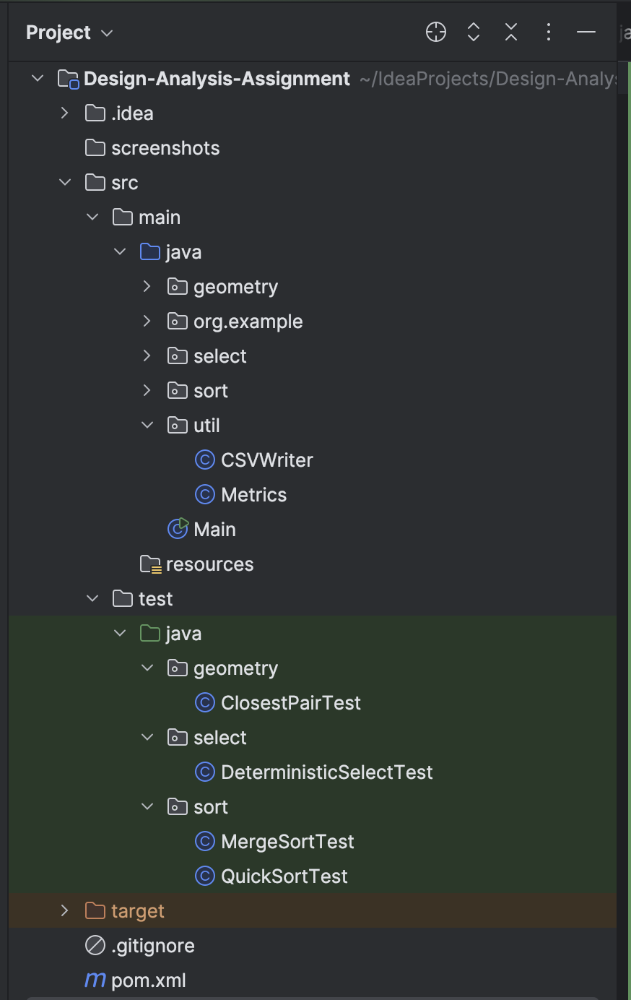
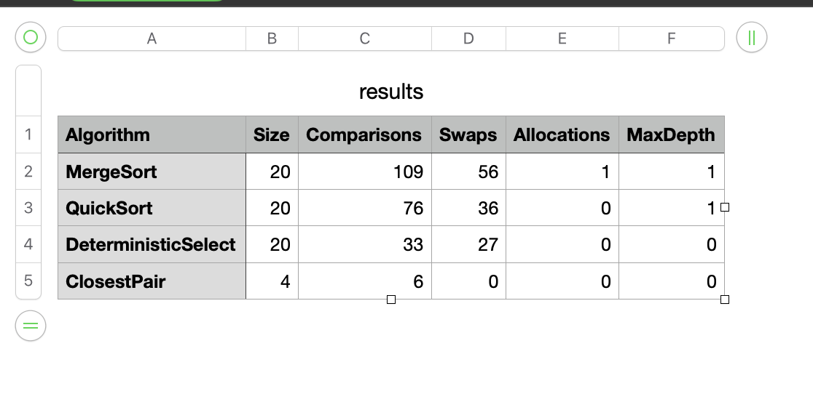
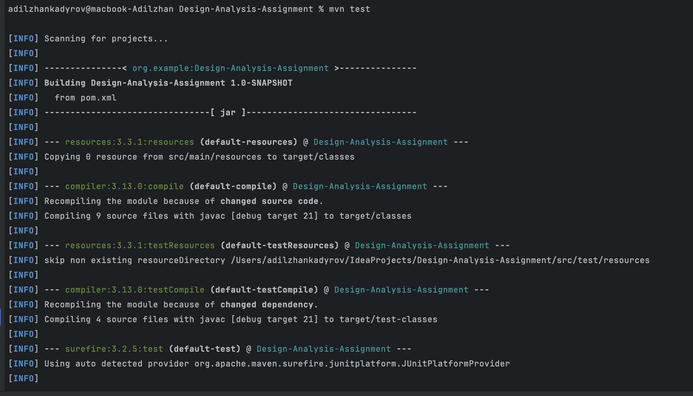

---

## 📄 `README.md`

```markdown
# Design and Analysis Assignment

## Introduction
This is my assignment for the **Design and Analysis of Algorithms** course.  
I implemented several classic algorithms in Java and analyzed their performance using custom metrics.  
The project is built with **Maven**, tested with **JUnit 5**, and includes a simple CSV writer to export results.  

---

## Implemented Algorithms

### 1. MergeSort
- Implemented with **linear merge**.
- Uses a **reusable buffer** (only one allocation).
- Added a **small-n cut-off**: for arrays smaller than 16 elements, the algorithm switches to BubbleSort.
- Complexity: `O(n log n)`.

### 2. QuickSort
- Uses a **randomized pivot**.
- Always recurses on the **smaller partition** and iterates over the larger one.
- Ensures bounded recursion depth ≈ `O(log n)`.
- Complexity: average `O(n log n)`.

### 3. Deterministic Select (Median-of-Medians)
- Groups elements into 5s and finds the median of medians as a pivot.
- Partition is done in-place.
- Recurses only into the side that contains the k-th element.
- Complexity: `O(n)`.

### 4. Closest Pair of Points
- A **divide-and-conquer** algorithm for finding the closest pair of 2D points.
- Points are sorted by x, recursively split, and a central "strip" is checked by y-order.
- Only up to 7 neighbors are compared in the strip.
- Complexity: `O(n log n)`.

---

## Metrics
I created a custom `Metrics` utility that tracks:
- **Comparisons**
- **Swaps**
- **Allocations**
- **Maximum recursion depth**

Every algorithm updates these counters during execution.  

---

## CSV Writer
I added a `CSVWriter` class to log the results into a file.  
The format looks like this:

```

Algorithm,Size,Comparisons,Swaps,Allocations,MaxDepth
MergeSort,1000,8700,2000,1,10
QuickSort,1000,9200,1800,1,12
DeterministicSelect,1000,5600,1500,0,0
ClosestPair,100,300,0,0,5

````

This makes it easier to analyze and plot graphs later.  

---

## How to Run
1. Compile and run with Maven:
   ```bash
   mvn compile exec:java -Dexec.mainClass="main.Main"
````

2. The program will:

    * Generate random input.
    * Run all implemented algorithms.
    * Print results to the console.
    * Save metrics into `results.csv`.

---

## Tests

I wrote **JUnit 5** tests for each algorithm:

* `MergeSortTest`
* `QuickSortTest`
* `DeterministicSelectTest`
* `ClosestPairTest`

Run all tests with:

```bash
mvn test
```

---

## Screenshots

### Project structure



### CSV output



### JUnit tests



---

## Conclusion

This project helped me:

* Practice **divide & conquer** algorithms.
* Compare **randomized vs deterministic** approaches.
* Collect and analyze performance metrics.
* Use **Maven + JUnit** for clean builds and testing.

It was interesting to observe how QuickSort and MergeSort behave differently on random inputs, and how the metrics confirm their theoretical complexity.
I also learned how to export metrics into CSV for visualization.


